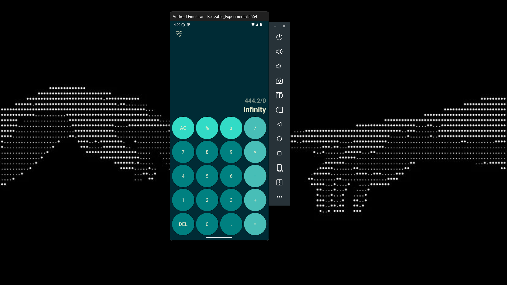
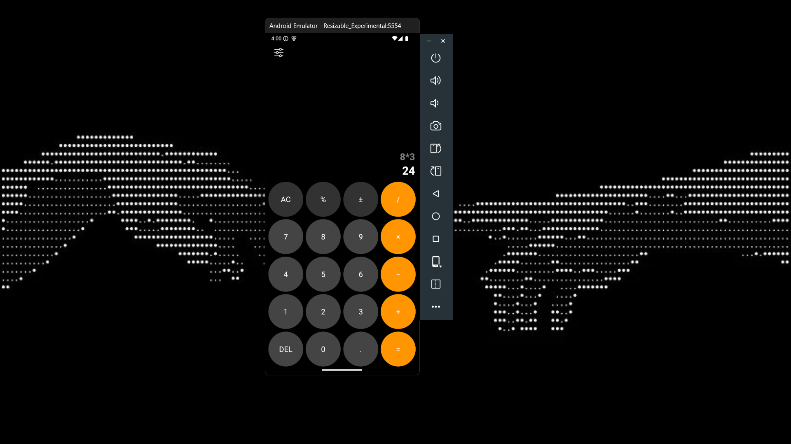
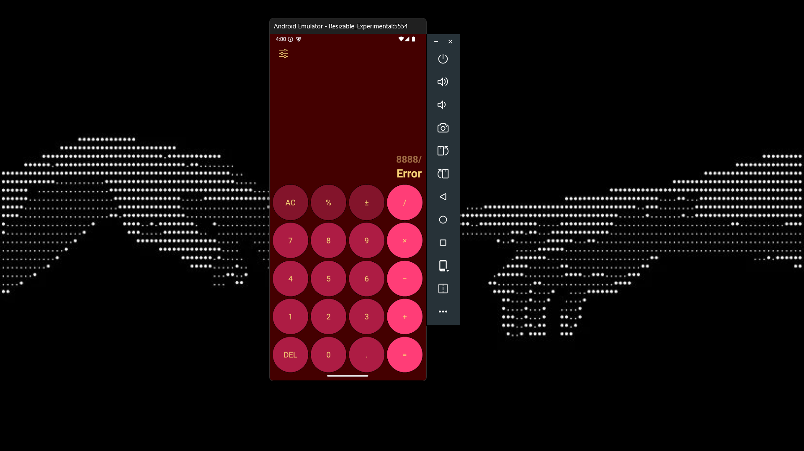
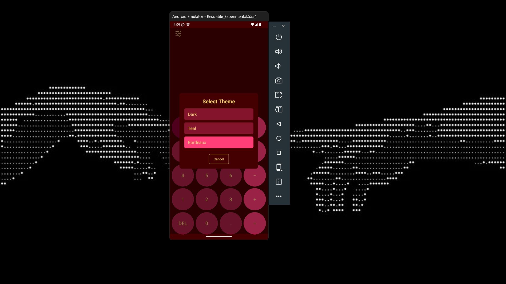

Sure! Here's a clean and professional `README.md` for your calculator app GitHub repo, following the same style as your LinkedIn post:

---

````markdown
# 📱 React Native Themed Calculator

A simple, elegant calculator app built with **React Native** and **TypeScript** — featuring real-time input handling, smooth UI, and **three dynamic themes**.

---

## ✨ Features

- ✅ Basic arithmetic operations: addition, subtraction, multiplication, division
- 🎨 Three selectable themes:
  - 🌙 Dark Mode
  - 🟦 Teal (Default)
  - 🔴 Red (used on error)
- 📲 Responsive design
- ⚠️ Handles edge cases (e.g. division by zero)
- 🧠 Real-time UI updates and display

---

## 📸 Screenshots

| Light/Teal Theme                | Dark Theme                      | Error Mode (Red)              |
| ------------------------------- | ------------------------------- | ----------------------------- | --------------------------------- |
|  |  |  |  |

_(Make sure to create a `/screenshots` folder and add your actual screenshots)_

---

## 🚀 Getting Started

### 1. Clone the Repository

```bash
git clone https://github.com/charbel-j-estephan/React-Native-projects.git
cd CalculatorApp
```
````

### 2. Install Dependencies

```bash
npm install
# or
yarn
```

### 3. Run the App

Make sure you have your Android/iOS emulator running or a device connected:

```bash
npx react-native run-android
# or
npx react-native run-ios
```

---

## 🧠 Why I Built This

As a student starting with React Native, I wanted to challenge myself with a small but complete project. This calculator helped me understand component structure, state handling, styling, and working with dynamic themes. It’s the foundation for more complex apps involving user interaction and data.

---

## 🔮 Next Steps

- ⛅ Integrate live APIs (weather, currency, etc.)
- 📜 Add a calculation history panel
- 💾 Possibly local storage support

---

## 📂 Project Structure

```
├── components/
│   ├── Button.tsx
│   └── ThemeToggle.tsx
├── assets/
│   └── icons/
├── themes/
│   └── colors.ts
├── App.tsx
└── ...
```

---

## 📃 License

MIT License. Free to use, fork, and modify.

---

## 🙌 Contributions

Feedback and contributions are welcome! Feel free to open issues or submit PRs.

```

---

Let me know your actual GitHub repo URL, and I’ll personalize the clone link and footer section. Want me to also generate the screenshot placeholders with your images?
```
